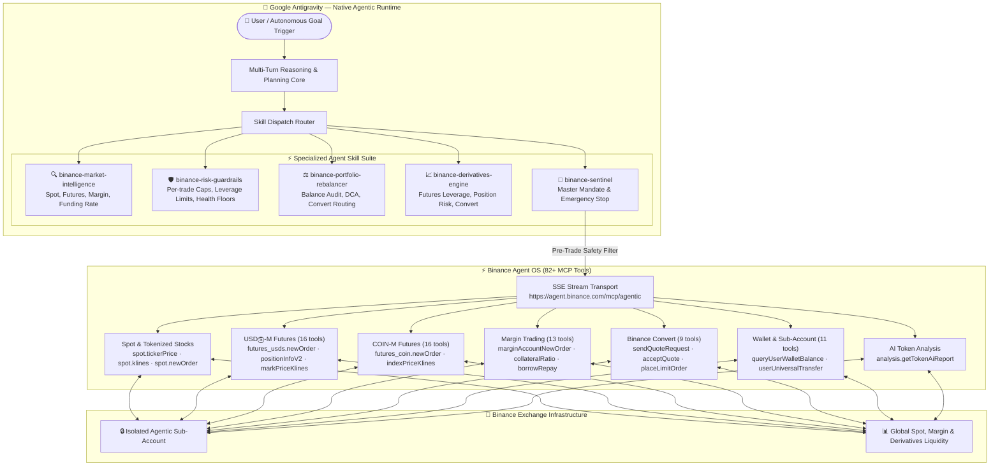

<div align="center">

# ⚡ Binance Sentinel-OS

### Autonomous Full-Stack AI Trading & Intelligence Agent — Native to Google Antigravity (AGY)

[](https://developers.binance.com/en/docs/agent-native/mcp-server)
[](https://antigravity.dev)
[](https://modelcontextprotocol.io)
[](#)
[](./LICENSE)

**Official Submission for the Binance Agent OS Mini Hackathon — Track A ($20,000 USDC Pool)**

---

</div>

## 📌 Abstract & Vision

Traditional algorithmic trading bots are brittle, require constant maintenance, and are dangerously unconstrained. Standalone AI models hallucinate and lack real-time connection to financial settlement layers.

**Binance Sentinel-OS** bridges both worlds by turning **Google Antigravity (AGY)** — a state-of-the-art agentic AI runtime — into a multi-product, self-supervising financial co-pilot directly integrated with the official **Binance Agent OS Model Context Protocol (MCP)** endpoint.

Operating inside **isolated Binance Agentic Sub-Accounts**, Sentinel-OS blends multi-turn conversational reasoning with a modular skill suite covering **Spot, USDⓈ-M Futures, COIN-M Futures, Margin Trading, Binance Convert, and Wallet** — all governed by deterministic pre-trade risk guardrails and a one-command emergency killswitch.

---

## ⚡ Quick Start for Judges

> Want to run this yourself? → **[SETUP.md](./SETUP.md)** — Clone, install skills, connect Binance MCP, and run in under 10 minutes.
> 
> Want to see it in action? → **[DEMO_WALKTHROUGH.md](./DEMO_WALKTHROUGH.md)** — Exact prompt-by-prompt script matching the video demo.

---

## 🏛️ Full-Stack Architecture



---

## 🌟 Five-Skill Modular Intelligence Suite

| Skill | Role | MCP Tools Covered |
| :--- | :--- | :--- |
| **[`binance-sentinel`](./.agents/skills/binance-sentinel/SKILL.md)** | Master mandate, cross-product orchestration & emergency purge | All 82+ tools |
| **[`binance-market-intelligence`](./.agents/skills/binance-market-intelligence/SKILL.md)** | Technical analysis: Spot klines, Futures mark price, funding rate, orderbook depth, RSI/EMA, AI reports | `spot.klines` · `futures_usds.markPriceKlineCandlestickData` · `futures_usds.premiumIndexKlineData` · `spot.depth` · `analysis.getTokenAiReport` |
| **[`binance-risk-guardrails`](./.agents/skills/binance-risk-guardrails/SKILL.md)** | Pre-trade safety: Per-trade cap, daily limit, leverage ceiling (max 5x), margin health floor, emergency multi-product purge | `spot.deleteOpenOrders` · `futures_usds.cancelOrder` · `margin.marginAccountCancelAllOpenOrdersOnASymbol` |
| **[`binance-portfolio-rebalancer`](./.agents/skills/binance-portfolio-rebalancer/SKILL.md)** | Asset audit, drift analysis & DCA conversion planning | `spot.getAccount` · `wallet.queryUserWalletBalance` · `convert.sendQuoteRequest` · `convert.acceptQuote` |
| **[`binance-derivatives-engine`](./.agents/skills/binance-derivatives-engine/SKILL.md)** | Futures leverage setup, position & liquidation risk, COIN-M & USDⓈ-M, margin borrowing, zero-slippage Convert | `futures_usds.changeInitialLeverage` · `futures_usds.positionInformationV2` · `futures_coin.newOrder` · `margin.marginAccountBorrowRepay` |

---

## 🛡️ Security & Risk Model

| Layer | Rule |
| :--- | :--- |
| **Sub-Account Isolation** | Agent operates exclusively inside an isolated Binance Agentic Sub-Account. No external withdrawals ever invoked. |
| **Spot Trade Cap** | Maximum $50.00 USDT notional per spot order. Max $250.00 USDT in any 24-hour window. |
| **Futures Leverage Cap** | Hard ceiling of 5x on any USDⓈ-M or COIN-M contract. ISOLATED margin mode enforced. |
| **Margin Health Floor** | Cross-margin collateral ratio must be ≥ 2.0 before any borrow or margin order. |
| **Emergency Circuit Breaker** | One-command simultaneous cancellation of ALL open orders across spot, futures, and margin. |
| **Zero Credential Storage** | Authentication uses Binance Agent OS secure OAuth session transport. No API keys committed. |

---

## 🚀 Live Demo Examples (AGY Native Prompts)

### Market Intelligence Across Products
```
User: "Sentinel: Analyze BNB and compare spot vs futures mark price. Check funding rate."
Agent:
  → [spot.ticker24hr]          BNB Spot: $594.30 (+2.1% 24h)
  → [futures_usds.symbolPriceTicker]  BNB Perp Mark: $594.80 (+$0.50 premium)
  → [futures_usds.premiumIndexKlineData] Funding rate: +0.01% (neutral/mildly bullish)
  → Analysis: "BNB futures trading at slight premium to spot. Funding neutral.
               EMA-9 above EMA-21. RSI-14: 52 (neutral). No strong entry signal yet."
```

### Derivatives Position Setup with Guardrails
```
User: "Sentinel: Open a 3x long BNB futures position."
Agent:
  → [futures_usds.changeMarginType]      Set ISOLATED margin ✓
  → [futures_usds.changeInitialLeverage] Set 3x (within 5x cap) ✓
  → [futures_usds.positionInformationV2] Verify no existing conflicting position ✓
  → [futures_usds.newOrder]              Limit long order placed ✓
```

### Guardrail Interception
```
User: "Sentinel: Go 20x on BTC futures."
Agent:
  → Risk Guardrail REJECTED:
    "Leverage 20x exceeds the hard cap of 5x. Execution halted.
     Recommend maximum 5x ISOLATED if you want to proceed."
```

### Zero-Slippage Convert
```
User: "Sentinel: Convert 50 USDT to BNB instantly."
Agent:
  → [convert.sendQuoteRequest]  Quote: 50 USDT → 0.0841 BNB (valid 15s)
  → [convert.acceptQuote]       Conversion settled ✓ No orderbook slippage.
```

### Emergency Stop — All Products
```
User: "Sentinel: /stop — cancel everything."
Agent:
  → [spot.deleteOpenOrders]                              Spot orders cleared ✓
  → [futures_usds.currentAllOpenOrders] → cancelOrder    Futures orders cleared ✓
  → [margin.marginAccountCancelAllOpenOrdersOnASymbol]   Margin orders cleared ✓
  → "All open orders across Spot, Futures, and Margin have been cancelled."
```

---

## 📁 Repository Structure

```
binance-agent-os-agy/
├── .agents/
│   └── skills/
│       ├── binance-sentinel/               # Master multi-product mandate
│       ├── binance-market-intelligence/    # Spot, Futures & Margin technical analysis
│       ├── binance-risk-guardrails/        # Pre-trade safety across all products
│       ├── binance-portfolio-rebalancer/   # Balance audit & DCA planning
│       └── binance-derivatives-engine/     # Futures, Margin & Convert execution
├── AGENTS.md                               # AGY operating rules & invariants
├── DEMO_WALKTHROUGH.md                     # Video demo script for hackathon judges
├── LICENSE                                 # MIT License
├── .gitignore                              # Zero credential leak policy
└── README.md                               # This document
```

---

## 🏆 Hackathon Compliance (Track A)

| Requirement | Status |
| :--- | :--- |
| **Track** | Track A — Build an AI Agent using Binance Agent OS |
| **Agent Framework** | Google Antigravity (AGY) — Native Agentic Runtime |
| **MCP Protocol** | Official Binance Agent OS endpoint (`https://agent.binance.com/mcp/agentic`) |
| **Products Covered** | Spot, USDⓈ-M Futures, COIN-M Futures, Margin, Convert, Wallet |
| **Risk Controls** | Deterministic pre-trade guardrails across all products |
| **GitHub Repository** | ✅ Public repository with full documentation |
| **Video Demo** | ✅ Full demo script in [`DEMO_WALKTHROUGH.md`](./DEMO_WALKTHROUGH.md) |

---

## 📄 License

MIT © 2026 [`favorian1`](https://github.com/favorian1). Built for the Binance Agent OS Mini Hackathon.
