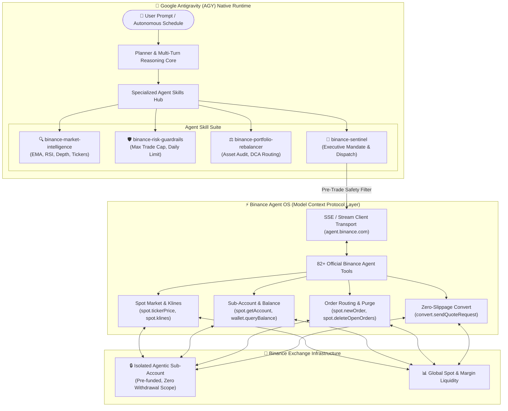

<div align="center">

# ⚡ Binance Sentinel-OS

### Autonomous Risk-Guarded AI Trading & Intelligence Agent Native to Google Antigravity (AGY)

[](https://developers.binance.com/en/docs/agent-native/mcp-server)
[](https://antigravity.dev)
[](https://modelcontextprotocol.io)
[](#)
[](https://opensource.org/licenses/MIT)

**Official Submission for the Binance Agent OS Mini Hackathon — Track A ($20,000 USDC Pool)**

---

</div>

## 📌 Abstract & Vision

Traditional algorithmic trading bots are brittle, complex to maintain, and prone to unconstrained execution failures. Conversely, standalone generative AI models hallucinate and lack real-time connection to financial settlement layers.

**Binance Sentinel-OS** bridges this divide by turning **Google Antigravity (AGY)** into an autonomous, self-supervising financial agent directly integrated with the official **Binance Agent OS Model Context Protocol (MCP)** endpoint.

Operating strictly within **isolated Binance Agentic Sub-Accounts**, Sentinel-OS blends multi-turn conversational reasoning with deterministic pre-trade risk guardrails, real-time market microstructure analysis, and one-click emergency killswitches.

---

## 🏛️ System Architecture



---

## 🌟 Specialized Skill Suite

Sentinel-OS modularizes its intelligence into four dedicated skills located in [`.agents/skills/`](file:///.agents/skills/):

| Skill Name | Focus & Capabilities | Integrated Binance MCP Tools |
| :--- | :--- | :--- |
| **`binance-market-intelligence`** | Technical momentum, EMA 9/21 crossovers, RSI-14 analysis, orderbook depth, and AI token sentiment. | `spot.tickerPrice`, `spot.klines`, `spot.depth`, `analysis.getTokenAiReport` |
| **`binance-risk-guardrails`** | Pre-trade compliance engine enforcing $50 trade caps, 24h spend ceilings, and symbol allowlists. | Pre-execution filter + `spot.deleteOpenOrders` |
| **`binance-portfolio-rebalancer`** | Sub-account asset audits, allocation drift tracking, and planned dollar-cost averaging (DCA). | `spot.getAccount`, `wallet.queryUserWalletBalance`, `convert.acceptQuote` |
| **`binance-sentinel`** | Master operational mandate orchestrating all skills and managing interactive user sessions. | All Agent OS tools |

---

## 🔒 Security & Sub-Account Isolation Model

Security is not an afterthought; it is built into the protocol layer:

1. **Sub-Account Boundary**: Sentinel-OS runs exclusively inside an isolated Binance Agentic Sub-Account. The agent has **no withdrawal or external transfer permissions**, eliminating fund drainage risk.
2. **Deterministic Pre-Trade Caps**:
   - Max single trade notional: **$50.00 USDT** (configurable).
   - 24-hour aggregate spend cap: **$250.00 USDT**.
   - Restricted trading universe: `BNBUSDT`, `BTCUSDT`, `ETHUSDT`, `SOLUSDT`.
3. **Emergency Circuit Breaker**: Immediate cancellation of all open orders across the sub-account via one command (`spot.deleteOpenOrders`).
4. **Zero Key Storage**: No API secrets or private keys are stored in code or repository commits; authentication uses Binance Agent OS secure session transport.

---

## 🚀 Live Demo Walkthrough (For Hackathon Judges)

You can interact with Sentinel-OS directly inside Antigravity using natural language:

### 1. Market Intelligence & Technical Regime
```text
User: "Sentinel: Analyze BNBUSDT 1-hour market structure and calculate RSI."
Agent:
- Invokes [spot.tickerPrice] -> BNB: $594.30
- Invokes [spot.klines] -> Computes RSI-14 (33.8) and EMA-9/21 cross
- Emits Analysis: "BNB is entering an oversold accumulation zone. Technical support holding at $590."
```

### 2. Sub-Account Audit & Exposure Check
```text
User: "Sentinel: Check sub-account balance and report current holdings."
Agent:
- Invokes [spot.getAccount] -> Queries real-time isolated wallet
- Emits Summary: "Free Margin: 120 USDT | 0.05 BNB | Zero active open orders."
```

### 3. Risk Guardrail Interception (Safety Demonstration)
```text
User: "Sentinel: Market buy 25 BNB right now."
Agent:
- Evaluates against Risk Guardrails Policy
- Emits Rejection: "🚨 Guardrail Violation: Order notional (~$14,850 USDT) exceeds maximum $50.00 USDT cap. Execution halted."
```

### 4. Controlled Execution & Emergency Purge
```text
User: "Sentinel: Place a safe test limit order for 0.02 BNB at $500, then cancel it."
Agent:
- Invokes [spot.newOrder] -> Order #1048291 created successfully
- Invokes [spot.deleteOpenOrders] -> Open orders cleared immediately
```

---

## 📁 Repository Structure

```
binance-agent-os-agy/
├── .agents/
│   └── skills/
│       ├── binance-sentinel/              # Master Operational Mandate
│       │   └── SKILL.md
│       ├── binance-market-intelligence/   # Technical & Microstructure Analysis
│       │   └── SKILL.md
│       ├── binance-risk-guardrails/       # Pre-trade Capital Protection Engine
│       │   └── SKILL.md
│       └── binance-portfolio-rebalancer/  # Sub-Account Balance & DCA Allocator
│           └── SKILL.md
├── AGENTS.md                              # AGY Operating Rules & Invariants
├── DEMO_WALKTHROUGH.md                    # Exact Script for Hackathon Video Demo
├── .gitignore                             # Strict exclusion rules (zero token leaks)
└── README.md                              # Hackathon Documentation
```

---

## 🏆 Hackathon Compliance (Track A)

- **Track**: Track A — Build an AI Agent using Binance Agent OS ($20,000 USDC Pool)
- **Agent Framework**: Google Antigravity (AGY)
- **Protocol**: Model Context Protocol (MCP) connecting to `https://agent.binance.com/mcp/agentic`
- **Official Tools Utilized**: `spot`, `wallet`, `convert`, `analysis`
- **Submission Requirements**: GitHub Repository + Video Demo + X Post

---

## 📄 License

This project is licensed under the MIT License — see the [LICENSE](LICENSE) file for details.
