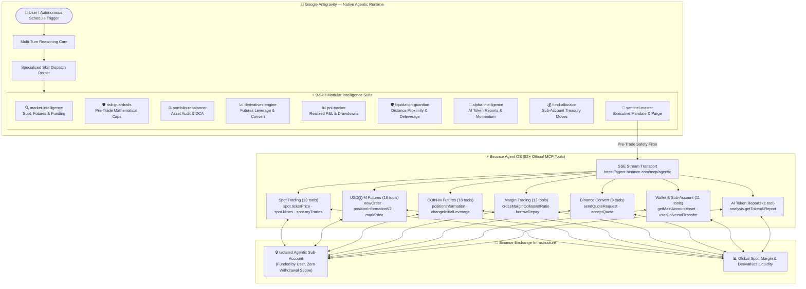

<div align="center">

# ⚡ Binance Sentinel-OS

### Autonomous Full-Stack AI Trading, Risk & Intelligence Agent — Native to Google Antigravity (AGY)

[](https://developers.binance.com/en/docs/agent-native/mcp-server)
[](https://antigravity.dev)
[](https://modelcontextprotocol.io)
[](#)
[](./LICENSE)

**Official Submission for the Binance Agent OS Mini Hackathon — Track A ($20,000 USDC Pool)**

---

</div>

## 📌 Abstract & Vision

Traditional algorithmic trading bots are brittle, require constant maintenance, and are dangerously unconstrained. Standalone AI models hallucinate and lack real-time connection to financial settlement layers.

**Binance Sentinel-OS** bridges both worlds by turning **Google Antigravity (AGY)** — a state-of-the-art agentic AI runtime — into a comprehensive, self-supervising financial co-pilot directly integrated with the official **Binance Agent OS Model Context Protocol (MCP)** endpoint.

Operating strictly inside **isolated Binance Agentic Sub-Accounts**, Sentinel-OS blends multi-turn conversational reasoning with a **9-skill modular intelligence suite** covering **Spot, USDⓈ-M Futures, COIN-M Futures, Margin Trading, Binance Convert, Automated P&L Attribution, Liquidation Defense, Alpha Discovery, and Treasury Management** — all governed by deterministic pre-trade risk guardrails and a one-command emergency killswitch.

---

## ⚡ Quick Start for Judges & Developers

> 🚀 **Want to run this yourself?** → **[SETUP.md](./SETUP.md)** — Step-by-step from zero (Binance sub-account setup, AI client installation for AGY/Claude Code/Cursor, MCP authentication, and live verification in under 15 minutes).
> 
> 🎯 **Want to see real agent outputs?** → **[EXAMPLES.md](./EXAMPLES.md)** — Clean production interaction logs across all capability areas.

---

## 🏛️ Full-Stack Architecture



---

## 🌟 9-Skill Modular Intelligence Suite

| Skill | Category | Capabilities & Integrated MCP Tools |
| :--- | :--- | :--- |
| **`binance-sentinel`** | Master Mandate | Executive command orchestrator, sub-account boundary enforcement, emergency purge across all markets. |
| **`binance-market-intelligence`** | Analysis | Spot klines, Futures mark price, funding rates (`futures_usds.premiumIndexKlineData`), orderbook depth (`spot.depth`), and EMA/RSI momentum. |
| **`binance-risk-guardrails`** | Safety | Pre-trade deterministic compliance: $50 trade cap, $250 24h spend limit, 5x leverage ceiling, ISOLATED margin floor. |
| **`binance-portfolio-rebalancer`** | Optimization | Balance audits (`spot.getAccount`), portfolio weight divergence tracking, and planned DCA allocation. |
| **`binance-derivatives-engine`** | Execution | USDⓈ-M & COIN-M Futures leverage configuration, position entries, cross/isolated margin, and zero-slippage Convert. |
| **`binance-pnl-tracker`** | Attribution | Realized/unrealized P&L accounting via `spot.myTrades`, 30-day equity snapshots (`wallet.dailyAccountSnapshot`), and win-rate analysis. |
| **`binance-liquidation-guardian`** | Risk Shield | Real-time liquidation distance calculations via `futures_usds.positionInformationV2`, automated deleverage triggers (< 15% distance). |
| **`binance-alpha-intelligence`** | Discovery | Momentum screener using `spot.ticker24hr`, orderbook imbalance walls, and Binance AI token sentiment via `analysis.getTokenAiReport`. |
| **`binance-fund-allocator`** | Treasury | Sub-account working capital right-sizing, internal transfers via `wallet.userUniversalTransfer`, and main account asset auditing. |

---

## 🛡️ Security & Sub-Account Isolation Model

1. **Sub-Account Boundary**: Sentinel-OS runs exclusively inside an isolated Binance Agentic Sub-Account. The agent has **no withdrawal or external transfer permissions**, eliminating fund drainage risk.
2. **Deterministic Pre-Trade Caps**:
   - Max single trade notional: **$50.00 USDT** (configurable).
   - 24-hour aggregate spend cap: **$250.00 USDT**.
   - Restricted trading universe: `BNBUSDT`, `BTCUSDT`, `ETHUSDT`, `SOLUSDT`.
   - Max futures leverage: **5x ISOLATED**.
3. **Liquidation Defense Shield**: Positions nearing liquidation price (< 15% buffer) trigger automated reduce-only orders.
4. **Emergency Circuit Breaker**: Immediate simultaneous cancellation of all open orders across spot, futures, and margin via `spot.deleteOpenOrders`.
5. **Zero Credential Leaks**: Uses Binance Agent OS secure session transport. No API keys or tokens are stored in code or git.

---

## 📁 Repository Structure

```
binance-agent-os-agy/
├── .agents/
│   └── skills/
│       ├── binance-sentinel/              # Master Multi-Product Mandate
│       ├── binance-market-intelligence/   # Technical & Microstructure Analysis
│       ├── binance-risk-guardrails/       # Pre-trade Capital Protection Engine
│       ├── binance-portfolio-rebalancer/  # Sub-Account Balance & DCA Allocator
│       ├── binance-derivatives-engine/    # Futures, Margin & Convert Execution
│       ├── binance-pnl-tracker/           # Historical Trade Attribution & ROI
│       ├── binance-liquidation-guardian/  # Dynamic Liquidation Shield & Deleverage
│       ├── binance-alpha-intelligence/    # 24h Momentum Scanner & AI Reports
│       └── binance-fund-allocator/        # Sub-Account Treasury Management
├── AGENTS.md                              # AGY Operating Rules & Invariants
├── SETUP.md                               # Zero-to-Live Guide (AGY / Claude / Cursor)
├── EXAMPLES.md                            # Production Interaction Logs
├── LICENSE                                # MIT License
├── .gitignore                             # Zero credential leak policy
└── README.md                              # Project Documentation
```

---

## 🏆 Hackathon Compliance (Track A)

- **Track**: Track A — Build an AI Agent using Binance Agent OS ($20,000 USDC Pool)
- **Agent Framework**: Google Antigravity (AGY) + compatible with Claude Code and Cursor
- **Protocol**: Model Context Protocol (MCP) connecting to `https://agent.binance.com/mcp/agentic`
- **Official Tools Utilized**: 82 tools across `spot`, `futures_usds`, `futures_coin`, `margin`, `convert`, `wallet`, `sub_account`, `analysis`
- **Submission Requirements**: GitHub Repository + Video Demo + X Post

---

## 📄 License

MIT © 2026 [`favorian1`](https://github.com/favorian1). Built for the Binance Agent OS Mini Hackathon.
