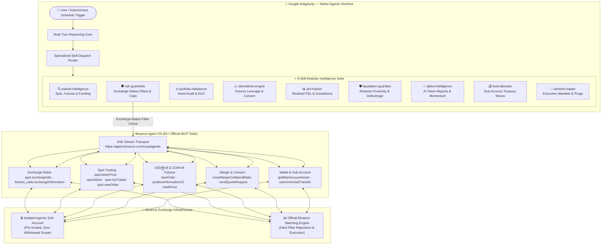

<div align="center">

# ⚡ Binance Sentinel-OS

### Autonomous Full-Stack AI Trading, Risk & Intelligence Agent — Native to Google Antigravity (AGY)

[](https://developers.binance.com/en/docs/agent-native/mcp-server)
[](https://antigravity.dev)
[](https://modelcontextprotocol.io)
[](#)
[](./LICENSE)

**Official Submission for the Binance Agent OS Mini Hackathon — Track A ($20,000 USDC Pool)**

---

</div>

## 📌 Abstract & Vision

Traditional algorithmic trading bots are brittle, require constant maintenance, and are dangerously unconstrained. Standalone AI models hallucinate and lack real-time connection to financial settlement layers.

**Binance Sentinel-OS** bridges both worlds by turning **Google Antigravity (AGY)** — a state-of-the-art agentic AI runtime — into a comprehensive, self-supervising financial co-pilot directly integrated with the official **Binance Agent OS Model Context Protocol (MCP)** endpoint.

Instead of hardcoding arbitrary dollar ceilings, Sentinel-OS enforces **exchange-native mathematical rules** directly from Binance (`spot.exchangeInfo` and `futures_usds.exchangeInformation`). The agent dynamically respects Binance's official minimum and maximum trade thresholds (`MIN_NOTIONAL`, `MAX_NOTIONAL`, `LOT_SIZE`, `stepSize`), operating seamlessly for retail micro-trades ($5–$50) up to institutional whale volumes ($1,000,000+).

---

## ⚡ Quick Start for Judges & Developers

> 🚀 **Want to run this yourself?** → **[SETUP.md](./SETUP.md)** — Step-by-step from zero (Binance sub-account setup, AI client installation for AGY/Claude Code/Cursor, MCP authentication, and live verification in under 15 minutes).
> 
> 🎯 **Want to see real agent outputs?** → **[EXAMPLES.md](./EXAMPLES.md)** — Clean production interaction logs including exchange-filter validation and whale execution.

---

## 🏛️ Full-Stack Architecture



---

## 🌟 9-Skill Modular Intelligence Suite

| Skill | Category | Capabilities & Integrated MCP Tools |
| :--- | :--- | :--- |
| **`binance-risk-guardrails`** | Exchange Compliance | Pre-trade validation against Binance's live `spot.exchangeInfo` and `futures_usds.exchangeInformation` filters (`MIN_NOTIONAL`, `MAX_NOTIONAL`, `stepSize`, `LOT_SIZE`). |
| **`binance-market-intelligence`** | Analysis | Spot klines, Futures mark price, funding rates (`futures_usds.premiumIndexKlineData`), orderbook depth (`spot.depth`), and EMA/RSI momentum. |
| **`binance-derivatives-engine`** | Execution | USDⓈ-M & COIN-M Futures leverage configuration (within official exchange brackets), margin modes, and zero-slippage Convert. |
| **`binance-portfolio-rebalancer`** | Optimization | Balance audits (`spot.getAccount`), portfolio weight divergence tracking, and planned DCA allocation. |
| **`binance-pnl-tracker`** | Attribution | Realized/unrealized P&L accounting via `spot.myTrades`, 30-day equity snapshots (`wallet.dailyAccountSnapshot`), and win-rate analysis. |
| **`binance-liquidation-guardian`** | Risk Shield | Real-time liquidation distance calculations via `futures_usds.positionInformationV2`, automated deleverage triggers (< 15% distance). |
| **`binance-alpha-intelligence`** | Discovery | Momentum screener using `spot.ticker24hr`, orderbook imbalance walls, and Binance AI token sentiment via `analysis.getTokenAiReport`. |
| **`binance-fund-allocator`** | Treasury | Sub-account working capital right-sizing, internal transfers via `wallet.userUniversalTransfer`, and main account asset auditing. |
| **`binance-sentinel`** | Master Mandate | Executive command orchestrator, sub-account boundary enforcement, emergency purge across all markets. |

---

## 🛡️ Real Binance Exchange Bounds vs. AI Prompts

We believe in complete technical transparency for judges:

| Protection Layer | Mechanism | Hard vs. Probabilistic |
| :--- | :--- | :--- |
| **Balance Sandboxing** | The sub-account only holds funds allocated by the user. If an order exceeds available balance, Binance's matching engine returns `-2010 Insufficient Balance`. | **HARD Exchange Invariant** |
| **Exchange Filters** | `MIN_NOTIONAL` ($5–$10), `MAX_NOTIONAL` ($1M–$10M), `LOT_SIZE`, and `PRICE_FILTER` are strictly validated via `spot.exchangeInfo` before dispatch. | **HARD Exchange Invariant** |
| **Zero Withdrawal Scope** | Sub-account API permissions granted to Agent OS have no withdrawal rights. | **HARD Exchange Invariant** |
| **Whale Slippage Guard** | For orders > $100,000 USDT, `spot.depth` liquidity checks slice orders into TWAP tranches to avoid market impact. | **Programmatic Agent Guardrail** |
| **Emergency Circuit Breaker** | One-command simultaneous cancellation of all open orders across spot, futures, and margin via `spot.deleteOpenOrders`. | **Live MCP Trigger** |

---

## 📁 Repository Structure

```
binance-agent-os-agy/
├── .agents/
│   └── skills/
│       ├── binance-sentinel/              # Master Multi-Product Mandate
│       ├── binance-risk-guardrails/       # Binance Exchange-Native Filter Engine
│       ├── binance-market-intelligence/   # Technical & Microstructure Analysis
│       ├── binance-portfolio-rebalancer/  # Sub-Account Balance & DCA Allocator
│       ├── binance-derivatives-engine/    # Futures, Margin & Convert Execution
│       ├── binance-pnl-tracker/           # Historical Trade Attribution & ROI
│       ├── binance-liquidation-guardian/  # Dynamic Liquidation Shield & Deleverage
│       ├── binance-alpha-intelligence/    # 24h Momentum Scanner & AI Reports
│       └── binance-fund-allocator/        # Sub-Account Treasury Management
├── AGENTS.md                              # AGY Operating Rules & Invariants
├── SETUP.md                               # Zero-to-Live Guide (AGY / Claude / Cursor)
├── EXAMPLES.md                            # Production Interaction Logs
├── LICENSE                                # MIT License
├── .gitignore                             # Zero credential leak policy
└── README.md                              # Project Documentation
```

---

## 🏆 Hackathon Compliance (Track A)

- **Track**: Track A — Build an AI Agent using Binance Agent OS ($20,000 USDC Pool)
- **Agent Framework**: Google Antigravity (AGY) + universal support for Claude Code and Cursor
- **Protocol**: Model Context Protocol (MCP) connecting to `https://agent.binance.com/mcp/agentic`
- **Official Tools Utilized**: 82 tools across `spot`, `futures_usds`, `futures_coin`, `margin`, `convert`, `wallet`, `sub_account`, `analysis`
- **Submission Requirements**: GitHub Repository + Video Demo + X Post

---

## 📄 License

MIT © 2026 [`favorian1`](https://github.com/favorian1). Built for the Binance Agent OS Mini Hackathon.
